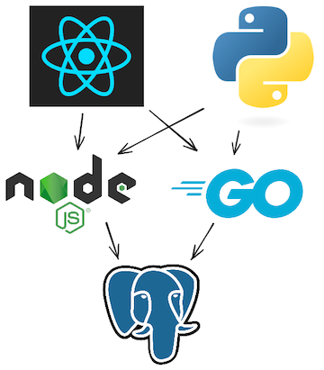

# Kubernetes Minimal 3-Tier Web Application

This project is a minimal 3-tier web application designed to demonstrate the setup and interaction of multiple services within a Kubernetes environment.

- **React frontend:** Uses react query to load data from the two apis and display the result.
- **Node.js and Go APIs:** Both have `/` and `/ping` endpoints. `/` queries the Database for the current time and the number of requests for each api recorded within the database, and `/ping` returns `pong`.
- **Postgres Database:** An empty PostgreSQL database with no tables or data. Used to show how to set up connectivity. The API applications execute `SELECT NOW() as now;` to determine the current time to return.
- **Python Load Generator:** Queries one of either the Node.js or Go APIs at a configurable speed.

It adds a simple load generator written in python and adds a simple database schema to track requests to each API.

## Technologies Used

- React: The frontend of the application, responsible for rendering the user interface and interacting with the backend APIs to display data. React Query is used to handle data fetching efficiently.
- Vite.js: A build tool used to run the React frontend application in development mode. Vite provides fast hot-reloading and optimized builds for React.
- Node.js: One of the backend APIs, written in Node.js, which handles requests from the frontend and interacts with the PostgreSQL database to retrieve and return data, such as the current time and request count.
- Go (Golang): The second backend API, written in Go, which serves similar functionality to the Node.js API. It responds to frontend requests and interacts with the database to return data.
- Containerization: Docker is used for containerizing applications to ensure consistent environments across development and production.
- PostgreSQL: A relational database used to store and manage data for the application. It is used to track the number of requests for each API and provides the current time via SQL queries.
- Python: Used for the load generator service. It simulates API traffic by querying either the Node.js or Go API at a configurable rate to generate load for testing purposes.
- Docker: Utilized to containerize services like PostgreSQL, ensuring consistent environments and easy deployment across different systems.
- Taskfile: A task runner that automates common commands for running the various services in the application (such as installing dependencies, running APIs, and starting the load generator).
- Poetry: A Python dependency manager used to install and manage dependencies for the load generator service.
  
## Running the Application

While the whole point of this course is that you probably won't want/need to run the application locally, we can do so as a starting point.

The `Taskfile` contains the commands to start each application:

### PostgreSQL

- It's way more convenient to run postgres in a container, so we will do that.

- `task postgresql:run-postgres` will start postgres in a container and publish port 5432 from the container to your localhost.

**🚨 NOTE:** After starting the database, you need to run the migration file in `./postgresql/migrations` to create the table that the APIs use. This can be done with `postgresql:run-psql-init-script`.

### api-node - Node.js

- To run the node api you will need to `task api-node:install` to install the dependencies.

- After installing the dependencies, `task api-node:run` will run the api in development mode with nodemon for restarting the app when you make source code changes.

### api-golang - Golang

- To run the golang api you will need to run `task api-golang:install`.

- After installing the dependencies, `task api-golang:run` will build and run the api.

### client-react - Vite.js

- Like api-node, you will first need to install the dependencies with `task client-react:install`.

- After installing the dependencies, `task client-react:run` will use vite to run the react app in development mode.

### load-generator-python - Python

- This service uses poetry to manage dependencies. You will need to install the dependencies with `task load-generator-python:install`.

- After installing the dependencies, `task load-generator-python:run` will run the application.